# Curve_Tracer_testing
clone, no fork, https://github.com/JosephEoff/Rodriguez, blog https://josepheoff.github.io/posts/iv-1a

this repo was created casually as project folder and I did not aware any minor/major difference of the MIT/GPL or whatever of all of those fancy terms, thanks for the original author and reminding something may help.  
```
"Rodriguez" is licensed under the GNU General Public License, version 2.

Your repository has the license set to MIT. By the terms of the GPL, only the copyright holder (me, Joseph Eoff) can change the license.

Please change the license on the repository to GPL V2, or delete the repository.
```

how to change license of a exisitng repo.,  
https://github.community/t/how-to-change-license-for-a-repository/126844
delete license exisitng file.  
add license.txt  
set GPL V2  

### circuit diagram
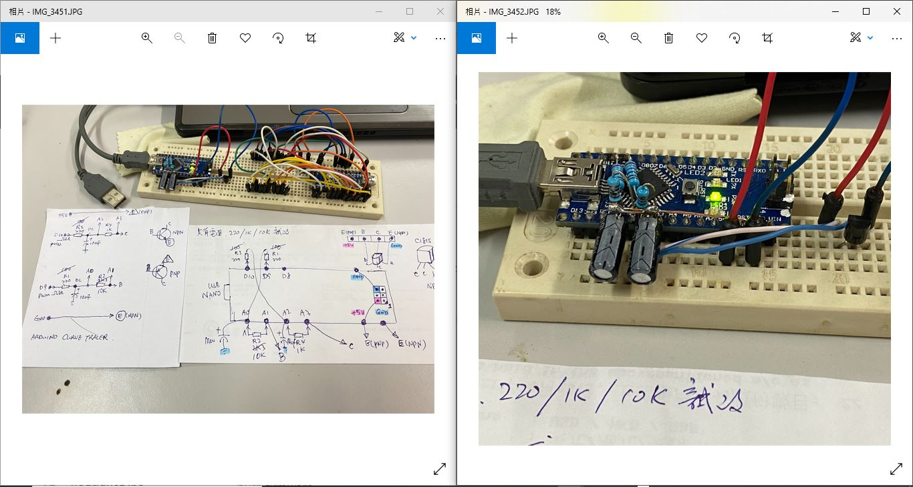  
schematic,  
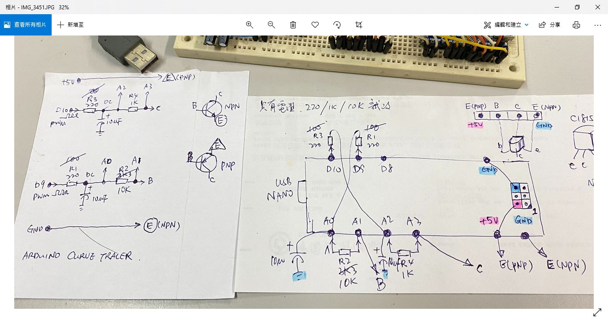  


### software, PC host, python 3.7 installed already
python, setup tool first for PC host software
```
python.exe -m pip install --upgrade pip
pip install pyqtgraph
pip install PyQT5
pip install auto-py-to-exe
pip install pyinstaller --onefile
```

run the PC host software  
```
python rodriguez.py  
```
looks like this,  
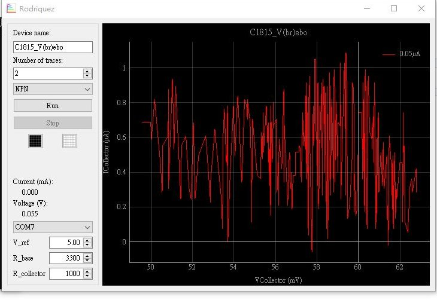 


build the PC host saftware to EXE, build ok, WIN10 did not work out, run time error, module forms not found
```
auto-py-to-exe
```

build the PC host saftware to EXE, WIN10, build ok, run ok  
```
pyinstaller --onefile rodriguez.py
```

### software, Arduino firmware (Atmega328p)
burn the chip, connect arduino Nano to PC  
change comport to your PC showing with burn_no_bootloader.bat  
run burn_no_bootloader.bat  
curve_tracer.hex will be upload to Nano    

or uses Arduino IDE, clone & compile the whole original project https://github.com/JosephEoff/Rodriguez  

No uses NANO but barebond Atmega328p or Atmega168p ? uses burn_use_usbtiny.bat via ISP interface.  
VCC /AVCC / GND/ MI / MO / SCK/ RESET, uses 8pins, AVCC / VCC must be connected together, GND is so.  
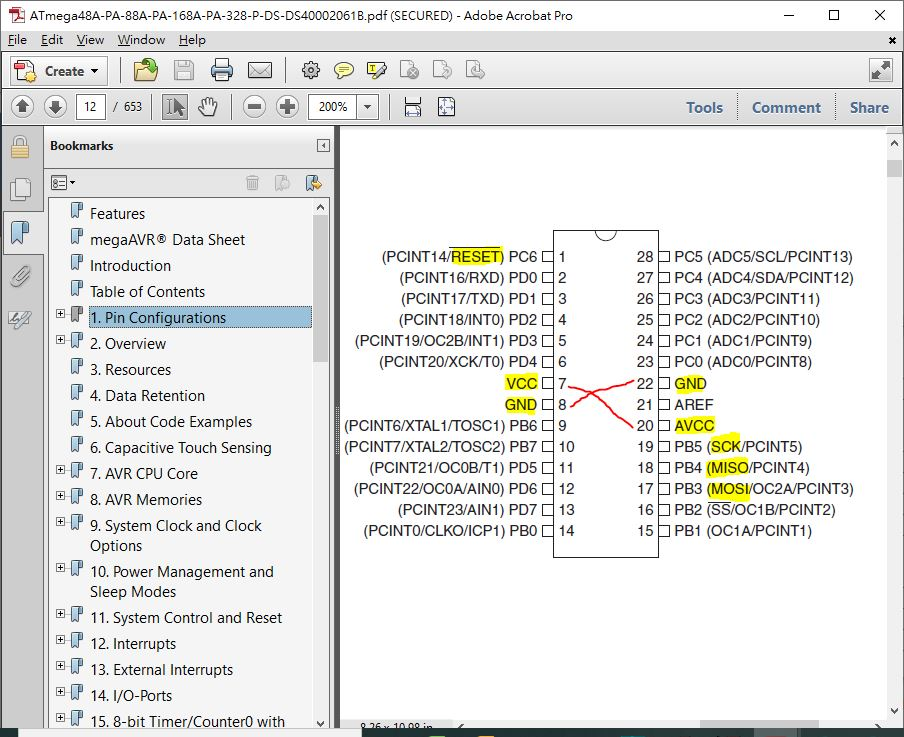  

### prototype is working perhaps but...
any of NPN curve trace is typical found from any of transistor data sheet, however my prototype was not getting anything close to those, not even to original author's nor 2SC1815's,  
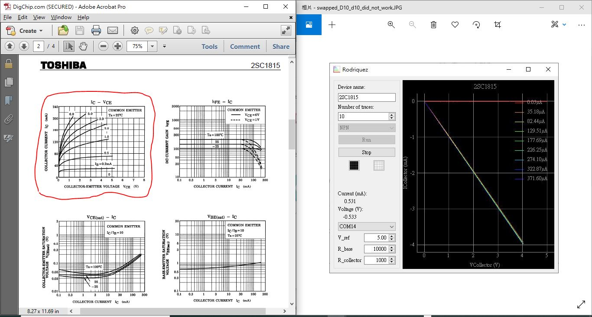    
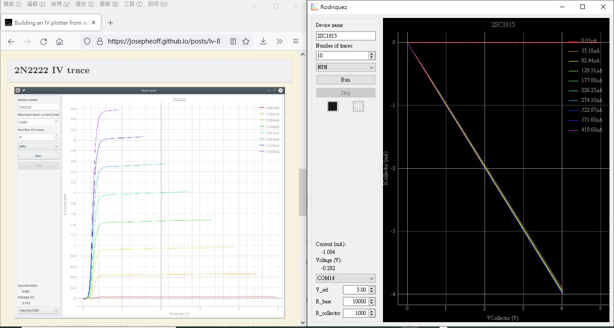    
.   
.  
Diode testing, LED used, the plot is a bit close to except sign of opposites  
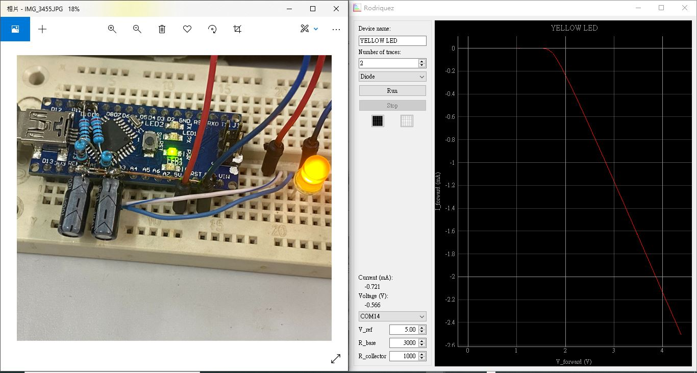  


### arduino code or perhaps the bug
nothing close the real rig as LED forward voltage drop should not be that 4V or above, the average is 3.1V of white LED and the Yellow one used should be 1.9V something, and however LED VF plot is usually the I/V mostlikely at 1st region. there are two question remains unknown, but why ? no digging to python source code becasue infamiliar with.
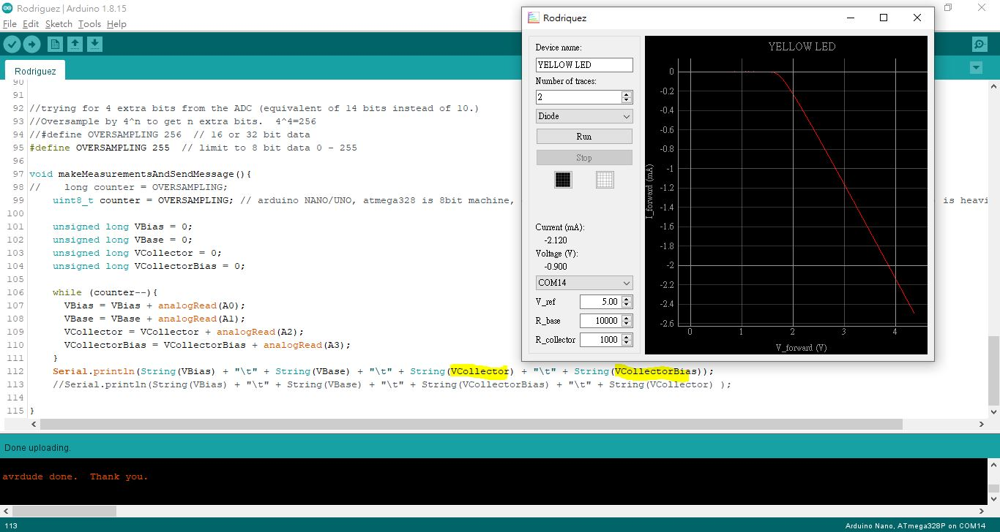    
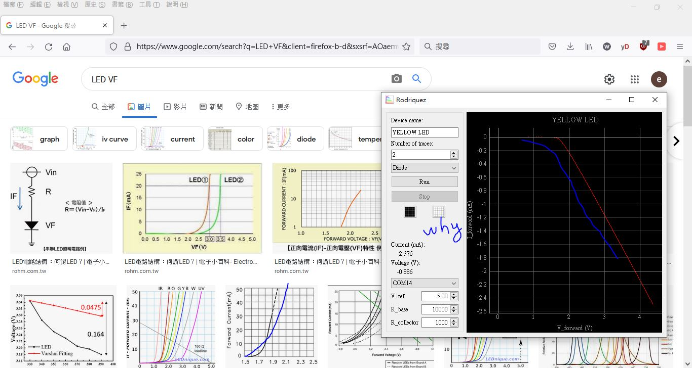  
 

The alternative is to find some more easy way for the beginner, looks at those serial communication in between the PC hostware and Atmega328p, here it is how it work out,

PC hostware sent string "0B\n0C\n" to arduino;  
Ardunio reply "0\t0\t0\t0\t\r\n" of which is in ASCII byte stream 0x30, 0x09, 0x30, 0x09, 0x30, 0x09m 0x30, 0x0d, 0x0a, and 0x09 is TAB, repeat the string 5 times, and then sent whatever required  
string format is again "123\t234\t456\t678\t\r\n"  
PC hostware is going to display something for visual as long as click "RUN"  
the testing arduino code is confirmed, no issue to see positive VF plot, try the code as folliwng,
```
// xiaolaba, testing the hostware of curve tracer, why and how VF plot get negative
// 2021-SEP-04
// load this code to arduino/uno/nano or atmega328p
// click the "RUN" if hostware

void setup() {
  // put your setup code here, to run once:

  Serial.begin(1000000);
  for (uint8_t i = 0; i<5 ; i++) {
    Serial.println("0\t0\t0\t0");
  }
}

//dummy value sent to hostware
uint32_t VBias=1023, VBase=1023, VCollector=1023, VCollectorBias=1023;

void loop() {
  VBias+=100;
  VBase+=200;
  VCollector+=300;
  VCollectorBias+=400;
  
  // put your main code here, to run repeatedly:

  // test for NPN or PNP mode
  Serial.println(String(VBias) + "\t" + String(VBase) + "\t" + String(VCollector) + "\t" + String(VCollectorBias));
  delay(20); // 20 or above is a must otherwise pumping data to PC hostware, overflow

  // test for Diode mode
//  Serial.println("0\t0\t" +String(VCollector) +"\t" +String(VCollectorBias) ); 
//  delay(20); // 20 or above is a must otherwise pumping data to PC hostware, overflow

}
```

this is interesting enough to see a really "bug" perhaps within the arduino firmware code but not the PC hostware, what really instresting is to know the WHY and how to see this why. As original author saying the design is base on OHM's law and does all calculation/plot at PC hostware, there must be something and the cause to see wrong VF calculation and plot region. recap the graphing line between two points, y=ax+b, it is something that we need to take care, the negative sign will possible lead to wrong plot and region, and solution is making all calculation has positive result, try this, swap two values of which greater one leading and smaller one follow after, there will be always positive sign with substraction, in contrast there will be negative result. try this to prove the concept, plot again, seems working as expected, and yellow LED VF plot close to the DMM reading 1,89V at the end, and plot is looks to close to usual VF plot.
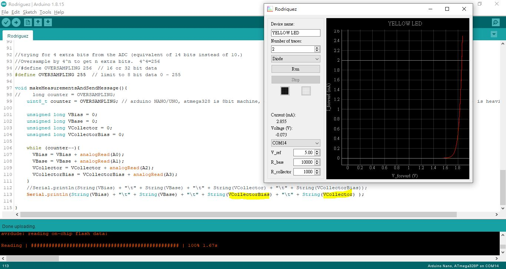  


### tracing speed consideration
oversampling was good however user has to be very very very patient and waiting for the completion. Try different way, 8 bit machine and hardware filtering design, no uses oversampling thus the speeding up, tracing a LED / diode likely less than 10 seconds, and the curve is still possible very matching raw plot, filter coefficient has been tested from 0 (no filtering) to max 8, so far 0 - 4 should be ok. but it is not working for NPN/PNP tracing, did not know why, used this for diode only. experimental hex code are these provided, [burn_4x_use_usbtiny.bat](burn_4x_use_usbtiny.bat) & [curve_tracer4x.hex](curve_tracer4x.hex)  
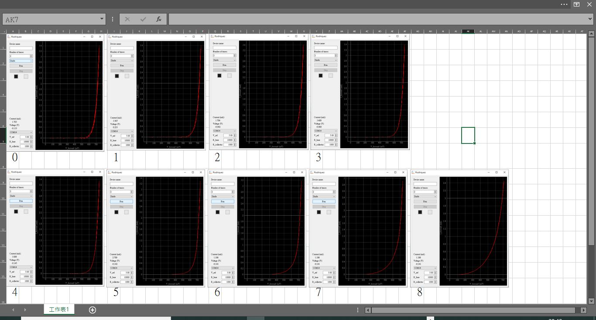   

