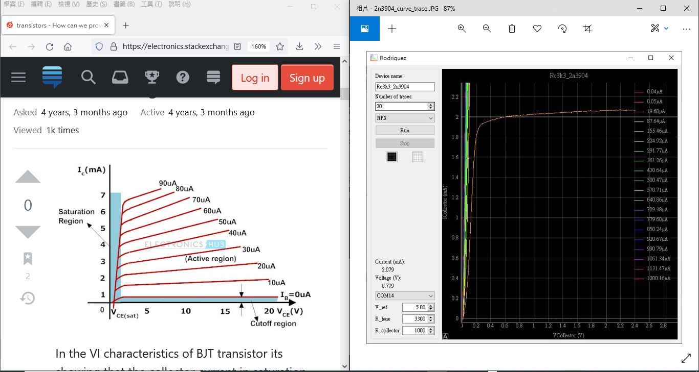
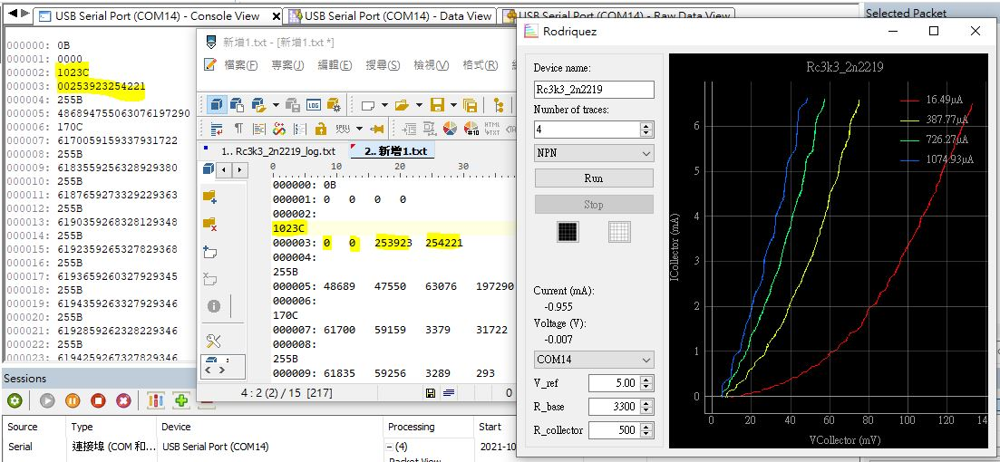
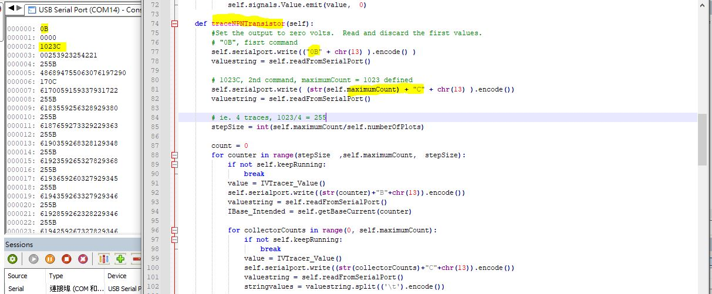
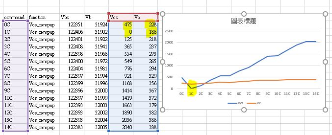
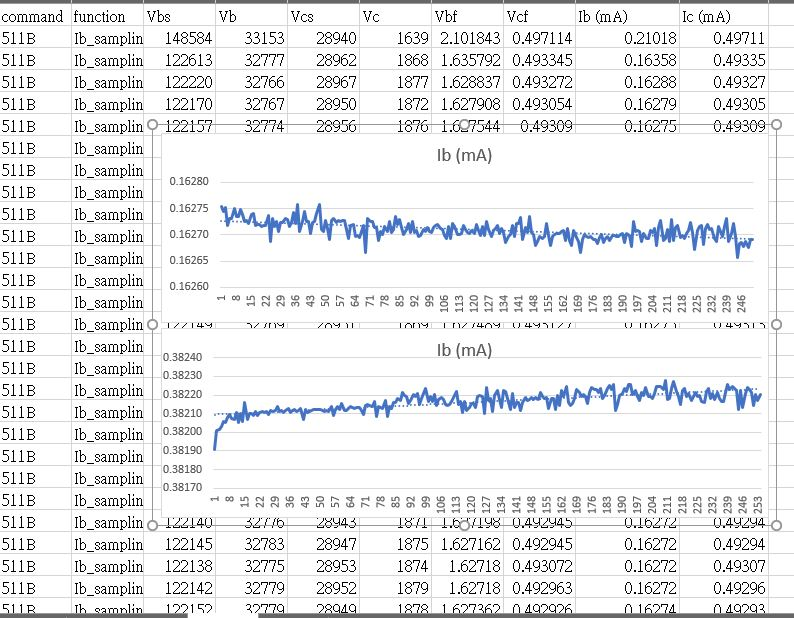

# Curve_Tracer_testing
clone, no fork, https://github.com/JosephEoff/Rodriguez, blog https://josepheoff.github.io/posts/iv-1a

this repo was created casually as project folder and I did not aware any minor/major difference of the MIT/GPL or whatever of all of those fancy terms, thanks for the original author and reminding something may help.  
```
"Rodriguez" is licensed under the GNU General Public License, version 2.

Your repository has the license set to MIT. By the terms of the GPL, only the copyright holder (me, Joseph Eoff) can change the license.

Please change the license on the repository to GPL V2, or delete the repository.
```

how to change license of a exisitng repo.,  
https://github.community/t/how-to-change-license-for-a-repository/126844
delete license exisitng file.  
add license.txt  
set GPL V2  

### circuit diagram
  
schematic,  
  


### software, PC host, python 3.7 installed already
python, setup tool first for PC host software
```
python.exe -m pip install --upgrade pip
pip install pyqtgraph
pip install PyQT5
pip install auto-py-to-exe
pip install pyinstaller --onefile
```

run the PC host software  
```
python rodriguez.py  
```
looks like this, no need any external component, just burn the code to arduino, use fingers and touching A0-A3 will show something,  
 


build the PC host saftware to EXE, build ok, WIN10 did not work out, run time error, module forms not found
```
auto-py-to-exe
```

build the PC host saftware to EXE, WIN10, build ok, run ok  
```
pyinstaller --onefile rodriguez.py
```

### software, Arduino firmware (Atmega328p)
burn the chip, connect arduino Nano to PC  
change comport to your PC showing with burn_no_bootloader.bat  
run burn_no_bootloader.bat  
curve_tracer.hex will be upload to Nano    

or uses Arduino IDE, clone & compile the whole original project https://github.com/JosephEoff/Rodriguez  

No uses NANO but barebond Atmega328p or Atmega168p ? uses burn_use_usbtiny.bat via ISP interface.  
VCC /AVCC / GND/ MI / MO / SCK/ RESET, uses 8pins, AVCC / VCC must be connected together, GND is so.  
  

### prototype is working perhaps but...
any of NPN curve trace is typical found from any of transistor data sheet, however my prototype was not getting anything close to those, not even to original author's nor 2SC1815's,  
    
    
.   
.  
Diode testing, LED used, the plot is a bit close to except sign of opposites  
  


### arduino code or perhaps the bug
nothing close the real rig as LED forward voltage drop should not be that 4V or above, the average is 3.1V of white LED and the Yellow one used should be 1.9V something, and however LED VF plot is usually the I/V mostlikely at 1st region. there are two question remains unknown, but why ? no digging to python source code becasue infamiliar with.
    
  
 

The alternative is to find some more easy way for the beginner, looks at those serial communication in between the PC hostware and Atmega328p, here it is how it work out,

PC hostware sent string "0B\n0C\n" to arduino;  
Ardunio reply "0\t0\t0\t0\t\r\n" of which is in ASCII byte stream 0x30, 0x09, 0x30, 0x09, 0x30, 0x09m 0x30, 0x0d, 0x0a, and 0x09 is TAB, repeat the string 5 times, and then sent whatever required  
string format is again "123\t234\t456\t678\t\r\n"  
PC hostware is going to display something for visual as long as click "RUN"  
the testing arduino code is confirmed, no issue to see positive VF plot, try the code as folliwng,
```
// xiaolaba, testing the hostware of curve tracer, why and how VF plot get negative
// 2021-SEP-04
// load this code to arduino/uno/nano or atmega328p
// click the "RUN" if hostware

void setup() {
  // put your setup code here, to run once:

  Serial.begin(1000000);
  for (uint8_t i = 0; i<5 ; i++) {
    Serial.println("0\t0\t0\t0");
  }
}

//dummy value sent to hostware
uint32_t VBias=1023, VBase=1023, VCollector=1023, VCollectorBias=1023;

void loop() {
  VBias+=100;
  VBase+=200;
  VCollector+=300;
  VCollectorBias+=400;
  
  // put your main code here, to run repeatedly:

  // test for NPN or PNP mode
  Serial.println(String(VBias) + "\t" + String(VBase) + "\t" + String(VCollector) + "\t" + String(VCollectorBias));
  delay(20); // 20 or above is a must otherwise pumping data to PC hostware, overflow

  // test for Diode mode
//  Serial.println("0\t0\t" +String(VCollector) +"\t" +String(VCollectorBias) ); 
//  delay(20); // 20 or above is a must otherwise pumping data to PC hostware, overflow

}
```

this is interesting enough to see a really "bug" perhaps within the arduino firmware code but not the PC hostware, what really instresting is to know the WHY and how to see this why. As original author saying the design is base on OHM's law and does all calculation/plot at PC hostware, there must be something and the cause to see wrong VF calculation and plot region. recap the graphing line between two points, y=ax+b, it is something that we need to take care, the negative sign will possible lead to wrong plot and region, and solution is making all calculation has positive result, try this, swap two values of which greater one leading and smaller one follow after, there will be always positive sign with substraction, in contrast there will be negative result. try this to prove the concept, plot again, seems working as expected, and yellow LED VF plot close to the DMM reading 1,89V at the end, and plot is looks to close to usual VF plot.
  


### tracing speed consideration
oversampling was good however user has to be very very very patient and waiting for the completion. Try different way, 8 bit machine and hardware filtering design, no uses oversampling thus the speeding up, tracing a LED / diode likely less than 10 seconds, and the curve is still possible very matching raw plot, filter coefficient has been tested from 0 (no filtering) to max 8, so far 0 - 4 should be ok. but it is not working for NPN/PNP tracing, did not know why, used this for diode only. experimental hex code are these provided, [burn_4x_use_usbtiny.bat](burn_4x_use_usbtiny.bat) & [curve_tracer4x.hex](curve_tracer4x.hex)  
   


### original author has arduino code patched up
The oroginal author is kindly enough to drop me a note that telling the arduino code fixed up and should ok to see good diode plot, that is excellent, later on to be testing again.

### learning material, learn from those goodies
As learning project going, those collected years ago of reading about Curve tracer design has been reviewed again,  as students perhaps instresting to know any of those to see good design and basis. this is the link and materials, [curve tracer design reading](https://github.com/xiaolaba/Curve_Tracer_testing/tree/main/curve%20tracer%20design%20reading).  

### coding and practices abstraction
Arduino code & the "bug" has nothing special but all the time with software/hardware development project and coexisted, how did you remeber every single detial or proof not to be wrong, no easy. The abstraction is better approach, try something new with coding skill,
```
#define Vbs_sense A0 // ADC0, used to detect Vb bias, the supply voltage
#define Vb_sense  A1 // ADC1, used to detect Vb voltage
#define Vcs_sense A2 // ADC2, used to detect Vc bias, the supply voltage
#define Vc_sense  A3 // ADC3, used to detect Vc voltage

/*    
      unsigned long VBias = 0;
      unsigned long VBase = 0;
      unsigned long VCollector = 0;
      unsigned long VCollectorBias = 0;
    
      VBias = VBias + analogRead(A0);
      VBase = VBase + analogRead(A1);
      VCollector = VCollector + analogRead(A3);
      VCollectorBias = VCollectorBias + analogRead(A2);
*/

      unsigned long Vbs = 0; // VBias, Vb bias, the supply voltage
      unsigned long Vb  = 0; // VBase
      unsigned long Vc  = 0; // VCollector
      unsigned long Vcs = 0; // VCollectorBias, Vc bias, the supply voltage
      
      // self proveness coding technique, abstraction
      // no longer required to rememebr what I/O pin should be
      Vbs = Vbs + analogRead(Vbs_sense); 
      Vb  = Vb  + analogRead(Vb_sense);
      Vcs = Vcs + analogRead(Vcs_sense);
      Vc  = Vc  + analogRead(Vc_sense);
      
      Serial.println(String(Vbs) + "\t" + String(Vb) + "\t" + String(Vc) + "\t" + String(Vcs));    
}
      
```

Once required to change wiring or need to swap those I/O pin, the code is required only to deal with the those #define, no others, for example,
```
#define Vbs_sense A5 // ADC5, used to detect Vb bias, the supply voltage
#define Vb_sense  A6 // ADC6, used to detect Vb voltage
#define Vcs_sense A7 // ADC7, used to detect Vc bias, the supply voltage
#define Vc_sense  A8 // ADC8, used to detect Vc voltage
```

this trying is not bad.

### Traces but why was my plot with a single curve only
Rb is the 10K (author used 3k3, but does not matter here) base resistor used, a variable source voltage source by PWM & RC filtering is taking place, hostware issuing command strings from "0B" to "1022B", it is telling the Atmega328p to clock the PWM output and ratio to match 1% to 100% power output, there Vb output and  resultant of base current Ib make sense to be Ib = Vbs / Rb.

experiment with setup 2 traces will see 3 command strings only for variable source voltage, for example "0B" "512B" and "1022B", that is equally saying 0%, 50% and 100% for the voltage source, because of the Arduino is 5V powered (actually is 4.75V pass through by a protection diode), 0% = 0V, 50% = 2.36V, 100% = 4.75V

To calcuate the Ib with 2.36v supply voltage,
Ib = 2.36V / 10k = 236uA

The Ib is far beyond the tracing purpose because NPN 2n3904 is dead hard turn on, nothing seeing for the active region but saturation.

This is really design constraint by hostware to stepping those number of traces, many of detail has been skipped, there are two possible soutlions, change Rb to be greater, or remove hostware constrain, let MCU to handle this Ib setting, either ways, the Ib may stepping form 10uA to 100uA by 10's increament to reveal a Ic/Vce typical plot. this is example, typical datasheet is showing traces with Ib 10uA - 60uA, my plot has only one steping from 10 to 100. that is why_my_trace_one_curve_only, now I understand. ofcourse, the plot became normal to fit to 1st quadrant as arduino code patched as original author fixed up, the same to correct negative sign of calculation result.
  


### Rb and Rc, change values for what
change values of Rb and Rc, next move will be trying Rb,100K and Rc,220 ohm, Ic will be double above, and hopefully see more traces of action region of my NPN transistor, turn it dead hard on or cut-off is so easy, but would be fun as seeing active region by myself because I had have no that tools/chance before this moment.  


### log and to see what was going on  
python code was not my knowledge so far, but it is plain-text code for an interpreter language something. Hostware is initiating the curve tracing for Ib stepping and Vce sampling, log and review those ascii strem as log and try to undestand the process.  
  

my logger windows, easy to see sequence but data stream has no display properly for delimiter TAB (0x09, or \t) and field separation, thus 4 fields of data stream Vbs\tVb\Vc\tVcs\r\n, it is simply given of very lengthen string of digits, no easy for human. logger problem or really hostware design or python limitation, do not know yet.  

Copy the log to text editor, the resultant is easy for human because of TAB was properly displayed, see four fields with desired numbers, however there were reduntant CRLF (\r\n, in c/c++ code) for each even line, the commands by hostware, except the first line 000000:0B, that was an issue so far no big deal as ardunio code handled \r\n or send those properly, but a bit confuse for my reading. let's see what could be done if feasible.  

hostware commanding curve tracer to prepare start of tracing, command sequency is 0B, 1023C, 170C and then repeat 510 times of 255B (4 traces mode, 1023/4 = 255, in case 2 traces, it would be 1023/2 = 511 round down).  
1. 0B, set Vb_supply to 0%  
2. 1023C, set Vc_supply to 100% (Atmega328p ADC in 10bit mode, total 1023 steps where 1023 came form)  
3. 170C, set Vc_supply to 170/1023= 16.7%, why ?  
4. 255B, set Vb_supply to 25%, but why loop 510 times for every trace ? charing the 10uf capacitor to build up steady Vb_supply voltage ?  

### python code the first glance
how the hostware to issue command "0B", digging and try my best to understand something new.  
the code and file, \forms\IVTracer.py  
yes, it is almost there and looks like python code is not so hard for understnading.  
  

### python code why CRLF reduntant
every Serial.write is giving the command flow to Arduino, and then serial.readline is used for capture tracing data, this is the point with reduntant CRLF, \r\n, \r and \n used by python code has difference, and Arduino sendout \r\n will trigger such CRLF reduntant. This is perhaps bug deep inside the python3.x,
```
    // console mode, python code used readline
    //
    // https://docs.python.org/3/library/io.html#io.IOBase.readline
    // readline(size=- 1)
    // Read and return one line from the stream. If size is specified, at most size bytes will be read.
    // The line terminator is always b'\n' for binary files; for text files, the newline argument to open() can be used to select the line terminator(s) recognized.
```

workaround, do not uses Serial.println("123"), try arduino code only with Serial.print("123\n")  


### CRLF redundant, whether the logger fault ?
scratching head did not help out, and found nowhere to have clue why has communication that undesired CRLF inserted in between arduino and hostware, both source codes of arduino and python examined and simplest test code, all of them seeing no problem but logger and output file always shit, original author even written me more detial and explained that \r used by hostware, and \r\n for arduino code.  
once back to town and will try to see what could be found with those open source tools, 
```
https://sourceforge.net/projects/com0com/files/latest/download com0com 3.0.0, Null-modem emulator com0com-3.0.0.0-i386-and-x64-signed.zip  
https://github.com/xiaolaba/SerialSniffer, fork and read issues, pathed two missing files, compile done       
```

### try to not uses logger but print() of python code to see CRLF and log
the side project was done, https://github.com/xiaolaba/com0com-serial-port-sniffer-testing
it is clear seeing something with python 3.x and the crlf bug incurred, let it be.
uses the print() to build the log, the idea is send command to arduino, read serial port and print everything to a single line to file.


```
import sys
logFile = "curve_trace_log.csv"
msg = ""
valuestring =""
f = open(logFile,'w')

def createLog(self):
        #with open(logFile,'w') as f:
        #    f.close()
        #open(logFile,'a') 
        f = open(logFile,'w')
        f.close()
        f = open(logFile,'a')
        sys.stdout = f # Change the standard output to the file we created.        
        

    def writeLog(self, s):
        #with open(logFile,'a') as f:
        #    f.write(s)
        #f.write(s)
        print (s, end="") ## end="" did not uses \r\n
        #print('hello')
    
    def closeLog(self):
        f.close()
        #sys.stdout = f # Change the standard output to the file we created.   
```


```
    def trace(self, command):
        msg = command       
        self.serialport.write(msg.encode())
        valuestring = (self.readFromSerialPort() ).strip()  ## strip() remove all \r \n \r\n
        print(msg.strip(), end="")  # no \r\n or crlf        
        print(valuestring.decode()) ## print(xx.decode()) string, output 'xx'    

    def traceNPNTransistor(self):
    
        self.createLog() # redirect print to stdout
        
        msg = "0B,setVbs_0%,\r"
        #Set the output to zero volts.  Read and discard the first values.
        #self.serialport.write(("0B"+chr(13)).encode())
        #self.serialport.write(("0B_setVbs_0%_\r").encode())
        self.serialport.write(msg.encode())

        valuestring = (self.readFromSerialPort() ).strip()  ## strip() remove all \r \n \r\n
        print(msg.strip(), end="")  # no \r\n or crlf
        #print(valuestring) ## print(xx) string, output b'xx\r\n'
        print(valuestring.decode()) ## print(xx.decode()) string, output 'xx'

```

log file, [curve_trace_log_0C_no_delay.csv](curve_trace_log_0C_no_delay.csv)  
```
command,function,Vbs,Vb,Vcs,Vc
0B,setVbs_0%,0,0,0,0
1023C,setVcs_100%,0,0,253953,254246
511B,set_Vb,191285,34733,181023,14456
170C,Get_Ib,243550,33956,31271,1292
...
...
```

something is interesting from the log data, every time Vce stepping from 0C to 1C, the Vcs & Vc has spike, but why ?

```
511B,Ib_sampling,122172,32727,28883,1847
511B,Ib_sampling,122160,32727,28887,1851
511B,Ib_sampling,122160,32703,28885,1856
0C,Vcs_rampup,122356,31771,474,272
1C,Vcs_rampup,122423,31753,0,245
2C,Vcs_rampup,122432,31753,129,268
3C,Vcs_rampup,122423,31752,372,291

...
...
...


1022B,Ib_sampling,244517,33947,28735,1229
1022B,Ib_sampling,244527,33940,28728,1225
0C,Vcs_rampup,244728,33414,462,246
1C,Vcs_rampup,244807,33405,0,234
2C,Vcs_rampup,244797,33405,0,248

```

the graph plot has a spike downward  
  


### Ib, the trends are different with different supply voltage  
the data log is given more detial  
Vbs setup 50%, trend downward, 100% with upward, why Ib was that ?   
oversampling 256 times, changed to 255 to fit with 8bit software counter, it does not affect those trends.  
  
